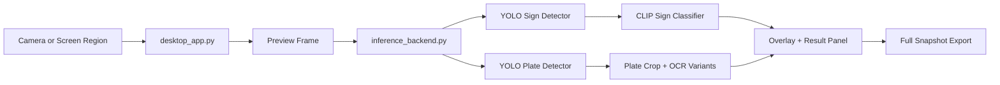

# TrafficSignVN Desktop Detection


Windows desktop application for Vietnamese traffic sign and license plate detection, packaged as a standalone GitHub-ready repository.

This repo contains:

- a desktop inference app
- a standalone backend
- the training notebook
- trained weights
- demo assets
- Git LFS configuration for large checkpoints

## Overview

The project is designed around one practical goal: run detection locally on Windows without depending on a browser, ngrok, or phone-side inference.

The desktop app supports two main input paths:

- direct Windows camera input
- selected screen-region capture for virtual camera setups such as Camo

The inference pipeline combines:

- YOLO for traffic sign detection
- YOLO for license plate detection
- CLIP classifier for sign refinement
- EasyOCR for reading license plate text

Preview mode is optimized for responsiveness.  
Full Snapshot mode is optimized for stronger results.

## Why This Repo Exists

The original project evolved through experiments in notebooks, web UI iterations, and runtime debugging. This package extracts the usable deployment core into a cleaner structure so it can be:

- run locally
- tested before publishing
- pushed to GitHub with the required weights
- shared without dragging along the whole original workspace

## Features

- Live traffic sign and license plate detection on Windows
- Screen-region capture fallback for Camo or problematic virtual cameras
- Full Snapshot mode for denser plate search
- Local save of image, overlay, and JSON metadata
- Standalone local weights under `weights/`
- Self-check mode to confirm the package is runnable before push/demo
- Git LFS configuration included for large `.pt` files

## Repository Structure

```text
TrafficSignVN_GitHub/
+-- desktop_app.py
+-- inference_backend.py
+-- start-desktop.ps1
+-- requirements.txt
+-- .gitattributes
+-- .gitignore
+-- weights/
|   +-- yolo_sign_best.pt
|   +-- yolo_plate_best.pt
|   +-- clip_classifier_v7.pt
+-- notebooks/
|   +-- main_v7_final.ipynb
+-- demo/
|   +-- demo_input.jpg
|   +-- demo_overlay.jpg
+-- captures/
```

## Architecture



## Runtime Flow

1. A frame is captured from a webcam or a selected screen region.
2. The desktop UI resizes the frame for preview.
3. The backend runs sign detection and plate detection.
4. In preview mode:
   - CLIP is disabled
   - OCR is disabled
   - the UI focuses on drawing fast bounding boxes
5. In full snapshot mode:
   - plate detection becomes denser
   - CLIP is used to refine traffic sign labels
   - OCR tries multiple crop variants and selects the best plate candidate
6. Results are rendered in the UI and optionally saved to `captures/`.

## Notebook Workflow

The notebook `notebooks/main_v7_final.ipynb` is not a single monolithic training script.  
It is organized as a sequence of experimental but logically connected stages.

### Cell 0: Project Overview

This cell defines the two big modules of the project:

- Module A: traffic sign detection with YOLO fine-tuning, followed by CLIP classification
- Module B: license plate detection with YOLO fine-tuning, followed by EasyOCR

This is the conceptual contract for the whole notebook.

### Cell 1: Dependency Bootstrap

This cell installs and imports the main libraries:

- `ultralytics`
- `easyocr`
- `torch`
- `open_clip`
- `opencv`
- plotting / metrics utilities

This is the notebook bootstrap layer.  
Without this cell, the rest of the notebook has no runtime foundation.

### Cell 2: Traffic Sign YOLO Dataset Preparation

This is the first important data engineering link in the notebook.

It does the following:

- points to `data/full/archive/images` and `data/full/archive/labels`
- reads the class list from `classes.txt` or `classes_en.txt`
- rebuilds the YOLO dataset folder from scratch to avoid stale files
- reuses `split_dataset/` if it already exists
- otherwise creates a new 80/20 split
- writes a `data.yaml` file for Ultralytics
- includes a guard against data leakage

Why it matters:

- if the train/val split is contaminated, all downstream mAP is misleading
- this cell is the notebook's dataset integrity checkpoint

### Cell 3: Fine-tune YOLOv8s for Traffic Signs

This is the main sign detector training cell.

Notebook choices:

- base model: `yolov8s.pt`
- epochs: `100`
- image size: `960`
- batch size: `4`
- optimizer: `AdamW`
- cosine LR schedule
- warmup: `5` epochs
- patience: `20`
- mixed precision: `amp=True`
- multi-scale training: `0.5`

Augmentations used:

- HSV jitter
- rotation
- translation
- scale
- shear
- mild perspective
- horizontal flip
- mosaic
- mixup
- copy-paste
- erasing

Intent:

- switch from a lighter baseline to `YOLOv8s`
- increase spatial resolution to help small sign detection
- keep augmentation rich enough to generalize to real-world conditions

### Cell 4: Evaluate Traffic Sign YOLO with TTA

This cell:

- loads the best sign checkpoint from `runs/detect/.../best.pt`
- evaluates without TTA
- evaluates again with `augment=True`
- compares mAP

This is important because the notebook explicitly treats training and inference as separate optimization stages.  
The model is not only tuned during training; the evaluation protocol is also strengthened by TTA.

### Cell 5: Visual Detection Test

This is the qualitative inspection link.

It displays:

- sampled test images
- predicted sign boxes
- visual sanity check on localization quality

This cell is where you catch problems that scalar metrics will hide:

- wrong box scale
- weird class confusion
- sign miss-detection in crowded scenes

### Cell 6: Build CLIP Classification Dataset

This cell starts the second stage of Module A.

It:

- loads `ViT-L-14` CLIP
- reads sign classes from `data/classes`
- skips invalid folders such as `Camera`
- enforces a minimum image count per class
- creates a `70/15/15` split
- builds PyTorch datasets and dataloaders

Role in the notebook:

- YOLO says "where"
- CLIP refines "what"

This separation is one of the core architectural decisions of the whole project.

### Cell 7: Train CLIP Classifier in Two Phases

This is one of the most important cells in the notebook.

The classifier is not trained in one shot.  
It is trained in two distinct stages:

1. Phase 2: freeze CLIP backbone and train only the MLP head on cached features
2. Phase 3: unfreeze the last visual blocks of CLIP and fine-tune a subset of the backbone

MLP head structure:

- `768 -> 512 -> 256 -> num_classes`
- BatchNorm
- ReLU
- Dropout

Phase 2 details:

- cached CLIP image features
- large batch training on features
- `CrossEntropyLoss(label_smoothing=0.1)`
- `AdamW`
- cosine annealing scheduler

Phase 3 details:

- unfreeze only the last 4 transformer blocks
- lower LR for backbone than for head
- gradient clipping
- validation-based best checkpoint selection

This is the notebook's representation learning link:

- Phase 2 trains a cheap classifier head quickly
- Phase 3 adapts high-level visual features to the domain

### Cell 8: CLIP Training Curves and Report

This cell visualizes:

- train loss
- val loss
- train accuracy
- val accuracy
- classification report

This is the diagnostic link for the classifier branch.

### Cell 9: Sign Full Pipeline with Smart Fusion

This cell combines:

- YOLO sign detection
- CLIP sign classification
- fusion rules between YOLO and CLIP

Important mechanics:

- small bounding boxes are filtered out
- ROI padding is applied before classification
- YOLO class names are mapped to CLIP class names where possible
- if CLIP is confident enough, CLIP wins
- otherwise YOLO can remain the final label
- disagreement between YOLO and CLIP is handled explicitly

This is the notebook's first real end-to-end inference link for traffic signs.

### Cell 10: Save CLIP Model and Summary

This cell persists:

- classifier weights
- class names
- CLIP metadata
- test metrics

It creates the deployable checkpoint `clip_classifier_v7.pt`.

### Cell 11: License Plate Dataset Preparation

This cell starts Module B.

It:

- extracts `yolo_plate_dataset.zip` if needed
- finds a flat plate dataset layout
- rebuilds a YOLO-ready folder
- creates an 80/20 train/val split
- writes `data.yaml`

This is equivalent to Cell 2, but for the plate branch.

### Cell 12: Fine-tune YOLOv8s for License Plates

This is the main detector training cell for license plates.

Notebook choices:

- base model: `yolov8s.pt`
- epochs: `100`
- image size: `960`
- batch size: `4`
- optimizer: `AdamW`
- patience: `20`
- mixed precision enabled
- `multi_scale=False`
- `deterministic=False`

Why different from the sign branch:

- license plates are very small and structured
- keeping `imgsz=960` fixed helps preserve plate detail
- disabling random multi-scale is meant to reduce resolution loss on tiny targets

Augmentation still exists, but is slightly more conservative than the sign branch.

### Cell 13: Evaluate License Plate YOLO with TTA

This cell mirrors Cell 4:

- load best plate checkpoint
- evaluate without TTA
- evaluate with TTA
- visualize sample predictions

This is the validation link for Module B.

### Cell 14: Full End-to-End Pipeline

This is the notebook's main integration cell.

It combines:

- traffic sign detector
- license plate detector
- CLIP sign classifier
- EasyOCR
- overlay rendering
- ROI previews

At this point, the notebook becomes a deployable system prototype rather than only a training notebook.

### Cell 15: Save Models and Final Summary

This cell saves:

- the CLIP classifier checkpoint
- references to the best sign and plate YOLO weights
- the final performance summary

This is the notebook handoff link between experimentation and deployment.

## YOLOv8 Fine-tune Design

The notebook fine-tunes `YOLOv8s`, not `YOLOv8n`, for both traffic sign detection and license plate detection.

### Why YOLOv8s

The notebook explicitly upgrades to `YOLOv8s` because:

- it has significantly more capacity than `YOLOv8n`
- small objects benefit from a stronger feature extractor
- the project cares more about practical detection quality than minimum model size

The notebook summary itself highlights this as one of the key improvements.

### YOLOv8 Architecture in This Project

At a high level, the detector follows the standard YOLOv8 pattern:

1. Backbone
2. Neck
3. Detection head

#### 1. Backbone

The backbone extracts multi-scale visual features from the input image.

Conceptually, this stage learns:

- edges
- corners
- textures
- object parts
- higher-level semantic patterns

For this project, this is where small sign shapes and plate-like rectangular structures first become separable.

#### 2. Neck

The neck fuses features from different scales so that:

- shallow layers contribute fine spatial detail
- deeper layers contribute semantic context

This is critical for:

- tiny traffic signs far from the camera
- narrow license plates embedded in larger scenes

Without good multi-scale fusion, the model will either:

- miss small objects
- or localize them poorly

#### 3. Detection Head

The YOLOv8 head predicts:

- box coordinates
- objectness / confidence
- class scores

For the plate branch:

- there is only one class: `license_plate`

For the traffic sign branch:

- the head predicts among the traffic sign classes defined in `classes.txt`

### Fine-tuning Strategy

The notebook does not train YOLO from scratch.  
It starts from pretrained `yolov8s.pt` and fine-tunes on project-specific datasets.

That means the optimization starts with generic visual priors already learned on large-scale data, then adapts them to:

- Vietnamese traffic signs
- Vietnamese license plates

### Why `imgsz=960`

One of the most important fine-tune choices in the notebook is `imgsz=960`.

Reason:

- both signs and license plates can be small in the scene
- a larger training resolution preserves more pixels per object
- this improves the chance that the detector learns stable features for small targets

Tradeoff:

- higher VRAM use
- lower throughput
- longer training time

The notebook accepts this cost in exchange for small-object detection quality.

### Why Batch Size = 4

This is a practical resource tradeoff:

- larger image size increases memory usage
- `YOLOv8s` also consumes more memory than `YOLOv8n`
- batch `4` is a compromise between stability and GPU memory limits

### Why AdamW + Cosine LR

The notebook uses:

- `optimizer='AdamW'`
- cosine LR schedule
- warmup epochs

Reasoning:

- AdamW is often easier to stabilize when fine-tuning on medium-sized custom datasets
- cosine decay allows smoother long-horizon adaptation
- warmup reduces instability at the start of training

### Why Multi-scale Is Different Between the Two YOLO Tasks

For traffic signs:

- `multi_scale=0.5`

Reason:

- signs appear at multiple scales in the real world
- moderate multi-scale helps robustness

For license plates:

- `multi_scale=False`

Reason:

- plates are small and text-sensitive
- aggressive resizing can destroy structure needed for good localization and OCR

This difference is one of the notebook's most meaningful design decisions.

### Why TTA Is Used in Evaluation

The notebook evaluates YOLO with `augment=True`, which effectively acts as TTA.

Goal:

- recover extra performance at inference time
- improve robustness on borderline objects
- squeeze more mAP from the trained checkpoint

This is especially useful when:

- objects are small
- angle or scale is inconvenient
- a single forward pass is not enough

### Augmentation Philosophy

The notebook does not use augmentation randomly just for decoration.  
It uses augmentation to simulate real-world variability.

Traffic sign branch:

- stronger geometric and appearance augmentation
- because road scenes vary in angle, lighting, distance, and clutter

License plate branch:

- still augmented, but more conservative in ways that protect text structure

### Fine-tune Outcome

In the notebook's logic, YOLOv8 fine-tuning is not the final classifier for signs.  
It is the localization engine.

That is why the architecture is:

- YOLO detects sign candidates
- CLIP refines sign category

For plates, YOLO is again the localization engine:

- YOLO detects plate region
- OCR reads the characters

So the fine-tuned YOLOv8 models are best understood as the first-stage proposal generators for the complete system.

## Models Used

### 1. Traffic Sign Detector

- File: `weights/yolo_sign_best.pt`
- Purpose: detect candidate traffic signs in the input frame

### 2. License Plate Detector

- File: `weights/yolo_plate_best.pt`
- Purpose: detect candidate Vietnamese license plates

### 3. CLIP Sign Classifier

- File: `weights/clip_classifier_v7.pt`
- Purpose: refine traffic sign class labels after YOLO detection

### 4. OCR

- Backend: EasyOCR
- Purpose: read detected plate text from cropped license plate regions

## Decision Logic

### Sign Label Selection

The final traffic sign label is chosen with a simple confidence gate:

\[
\text{final\_label} =
\begin{cases}
\text{clip\_label}, & \text{if } \text{clip\_score} \ge 0.4 \\
\text{yolo\_label}, & \text{otherwise}
\end{cases}
\]

This keeps CLIP useful without forcing it to override YOLO on weak crops.

### Plate Candidate Scoring

For plate OCR, the backend tries multiple image variants and scores candidates using a heuristic:

\[
\text{score} =
\text{ocr\_conf}
 + \text{length\_bonus}
 + \text{mix\_bonus}
 + \text{layout\_bonus}
 - \text{overlength\_penalty}
\]

Where:

- `ocr_conf`: OCR confidence from EasyOCR
- `length_bonus`: rewards plausible plate length
- `mix_bonus`: rewards alpha-numeric patterns
- `layout_bonus`: rewards merged two-line candidates when layout looks valid
- `overlength_penalty`: suppresses unrealistic long OCR concatenations

## Runtime Modes

| Mode | Detector | CLIP | OCR | Use case |
|---|---|---|---|---|
| Preview | fast | off | off | realtime overlay |
| Full Snapshot | denser | on | on | better final output |
| Screen Region Preview | fast + periodic dense plate pass | off | off | Camo / virtual camera fallback |
| Screen Region Snapshot | dense | on | on | stronger result on screen-captured content |

## Demo

Input:


Overlay:


## System Requirements

- Windows 10 or Windows 11
- Python 3.11 recommended
- NVIDIA GPU recommended for practical speed
- Git LFS required for pushing the large checkpoints

Notes:

- The app can still run on CPU, but performance will be much slower.
- The CLIP checkpoint is large, so a normal Git push without LFS is not enough.

## Installation

### Option A: Use a local virtual environment

```powershell
python -m venv .venv
.\.venv\Scripts\Activate.ps1
pip install -r requirements.txt
git lfs install
```

### Option B: Run with an existing environment

If you already have a Python environment with the required packages, just activate it and run:

```powershell
python .\desktop_app.py
```

## How To Run

### Launch the Desktop App

```powershell
python .\desktop_app.py
```

Or:

```powershell
.\start-desktop.ps1
```

### Run the Self-check

Use this before demos, before publishing, and before pushing changes:

```powershell
python .\desktop_app.py --self-check
```

Expected output should include:

- `"loaded": true`
- `"ready_full_flow": true`
- `"device": "cuda"` or `"cpu"`
- local paths under `weights/`

## How To Use the App

### Webcam Flow

1. Launch the app.
2. Click `Scan`.
3. Select a camera source.
4. Click `Start Camera`.
5. Use preview for quick feedback.
6. Click `Full Snapshot` when you want the stronger result.

### Screen Region Flow

Recommended when:

- a virtual camera does not expose valid frames to OpenCV
- you want to detect from a desktop window
- you use Camo and OpenCV camera probing is unreliable

Steps:

1. Open the source window you want to analyze.
2. Click `Select Region`.
3. Drag a rectangle over the visible content.
4. The app will start previewing that region.
5. Click `Full Snapshot` for stronger dense detection and OCR.

## Output Files

Each snapshot can produce:

- original image
- overlay image
- JSON metadata

Saved under:

```text
captures/
```

JSON metadata contains:

- capture id
- timestamp
- source type
- image file name
- overlay file name
- detection results
- runtime device

## GitHub Push Guide

This repository contains large model files. Use Git LFS:

```powershell
git init
git lfs install
git add .
git commit -m "Initial desktop detection package"
git branch -M main
git remote add origin <your-repo-url>
git push -u origin main
```

## Known Limitations

- Preview mode is speed-first, not accuracy-first.
- OCR quality depends heavily on crop quality and plate scale.
- Dense thumbnail grids from Google Images are much harder than real road scenes.
- The current OCR stack is generic OCR, not a plate-specialized recognizer.
- False positives increase when running dense detection on busy collage-style images.

## Practical Notes

- If preview looks noisy, trust `Full Snapshot` more than preview.
- If Camo camera does not open, use `Select Region`.
- If the app loads models but still prints a Hugging Face HEAD warning, it usually means the CLIP backbone is already cached locally and still usable.
- If you plan to share the repo publicly, keep Git LFS enabled or the large checkpoint push will fail.

## Included Assets

- `desktop_app.py`: Windows desktop UI and capture logic
- `inference_backend.py`: standalone detection and OCR backend
- `notebooks/main_v7_final.ipynb`: training / experimentation notebook
- `weights/yolo_sign_best.pt`: traffic sign detector
- `weights/yolo_plate_best.pt`: plate detector
- `weights/clip_classifier_v7.pt`: CLIP classifier checkpoint
- `demo/demo_input.jpg`: sample input
- `demo/demo_overlay.jpg`: sample overlay

## Roadmap

Possible next improvements:

- replace generic EasyOCR with a plate-specific OCR model
- add tile inference mode dedicated to ultra-dense screenshots
- export a Windows `.exe`
- improve plate post-processing for two-line Vietnamese plates
- add batch image evaluation mode

## Troubleshooting

### App starts but camera is black

- Try `Scan` again
- Try another backend
- If using Camo, prefer `Select Region`

### App loads but detection is weak

- Use `Full Snapshot`
- Increase plate size in frame
- Avoid testing only on tiny Google Images thumbnails

### Push to GitHub fails

- Run `git lfs install`
- Confirm `.gitattributes` exists
- Retry push after GitHub authentication

## Memes, But Accurate

> YOLO in preview mode: "I detect fast."

> OCR in dense thumbnail grids: "I detect vibes."

> Full Snapshot button: "Fine, I'll do it myself."

> Camo virtual camera on Windows: "Works on my machine" is a speculative statement.

## Final Note

This repo is optimized for a practical desktop demo pipeline, not for claiming perfect plate recognition on every internet collage.  
If the model performs well on actual road images and controlled desktop captures, that is the metric that matters.
