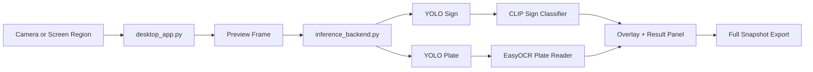
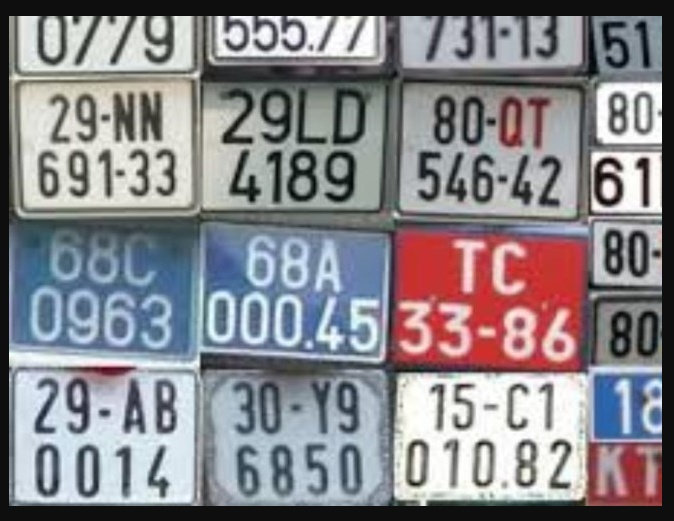
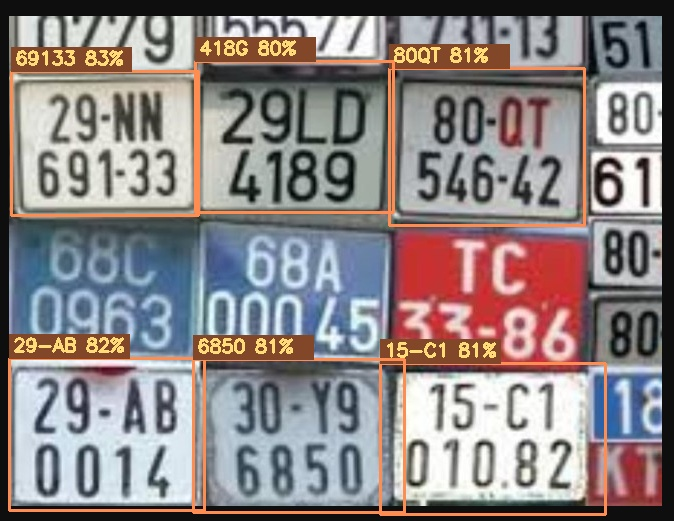

# TrafficSignVN Desktop Detection


Standalone Windows desktop app for Vietnamese traffic sign and license plate detection.  
This package is prepared as a GitHub-ready folder with:

- desktop inference app
- standalone backend
- training notebook
- trained weights
- demo images
- push-ready Git LFS configuration

## Features

- Live detection from webcam or selected screen region
- Screen-region fallback for virtual cameras such as Camo
- YOLO sign detector
- YOLO plate detector
- CLIP classifier for sign refinement
- EasyOCR-based license plate reading
- Full snapshot mode with denser plate search than preview mode
- Local capture export as image + overlay + JSON

## Repository Layout

```text
TrafficSignVN_GitHub/
├─ desktop_app.py
├─ inference_backend.py
├─ start-desktop.ps1
├─ requirements.txt
├─ .gitattributes
├─ .gitignore
├─ weights/
│  ├─ yolo_sign_best.pt
│  ├─ yolo_plate_best.pt
│  └─ clip_classifier_v7.pt
├─ notebooks/
│  └─ main_v7_final.ipynb
├─ demo/
│  ├─ demo_input.jpg
│  └─ demo_overlay.jpg
└─ captures/
```

## Architecture



## Core Logic

Sign label selection:

\[
\text{final\_label} =
\begin{cases}
\text{clip\_label}, & \text{if } \text{clip\_score} \ge 0.4 \\
\text{yolo\_label}, & \text{otherwise}
\end{cases}
\]

Plate candidate scoring:

\[
\text{score} = \text{ocr\_conf} + \text{length\_bonus} + \text{mix\_bonus} + \text{layout\_bonus} - \text{overlength\_penalty}
\]

Where:

- `length_bonus` rewards plausible plate length
- `mix_bonus` rewards alpha-numeric strings
- `layout_bonus` rewards merged two-line candidates
- `overlength_penalty` suppresses unrealistic OCR concatenations

## Runtime Modes

| Mode | Detector | OCR | Intended use |
|---|---|---|---|
| Preview | Fast sign + plate detect | Off | realtime UI |
| Full Snapshot | Dense plate search | On | final result and export |
| Screen Region | Fast preview + periodic dense plate pass | Off in preview, On in snapshot | virtual camera / Camo fallback |

## Demo

Input:



Overlay result:



## Requirements

- Windows 10/11
- Python 3.11 recommended
- NVIDIA GPU recommended for practical speed
- Git LFS required because `clip_classifier_v7.pt` is larger than normal GitHub file limits

## Setup

1. Create and activate a virtual environment.
2. Install dependencies.
3. Install Git LFS before pushing the repo.

```powershell
python -m venv .venv
.\.venv\Scripts\Activate.ps1
pip install -r requirements.txt
git lfs install
```

## Run

If your environment is already active:

```powershell
python .\desktop_app.py
```

Or use the helper script:

```powershell
.\start-desktop.ps1
```

## Self-check Before Push

Run this first to confirm the package loads the trained weights correctly:

```powershell
python .\desktop_app.py --self-check
```

Expected fields:

- `loaded: true`
- `ready_full_flow: true`
- `device: cuda` or `cpu`
- local `weights/...` paths in the output

## GitHub Push Notes

This folder includes large `.pt` files. Push with Git LFS:

```powershell
git init
git lfs install
git add .
git commit -m "Initial desktop detection package"
git branch -M main
git remote add origin <your-github-repo-url>
git push -u origin main
```

## Usage Notes

- `Select Region` is the preferred path for Camo or other virtual camera setups on Windows.
- Preview mode prioritizes speed, not final OCR accuracy.
- `Full Snapshot` is the mode to use when you want the strongest result currently available in this package.
- Google Images collages and dense thumbnail grids are harder than real traffic scenes and will still generate misses or false positives.

## Included Assets

- `notebooks/main_v7_final.ipynb`: training and experimentation notebook
- `weights/yolo_sign_best.pt`: trained sign detector
- `weights/yolo_plate_best.pt`: trained plate detector
- `weights/clip_classifier_v7.pt`: trained CLIP classifier checkpoint
- `demo/demo_input.jpg`: sample input
- `demo/demo_overlay.jpg`: sample overlay output
